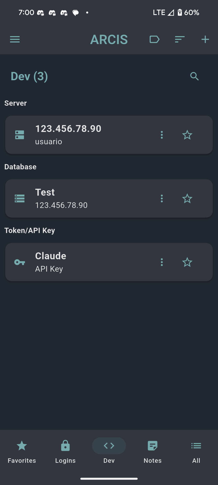
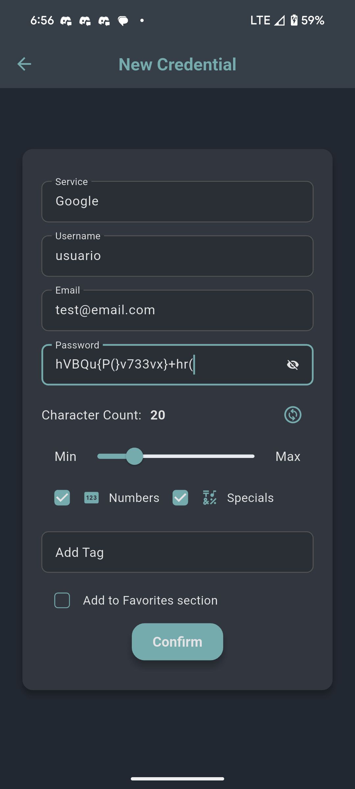
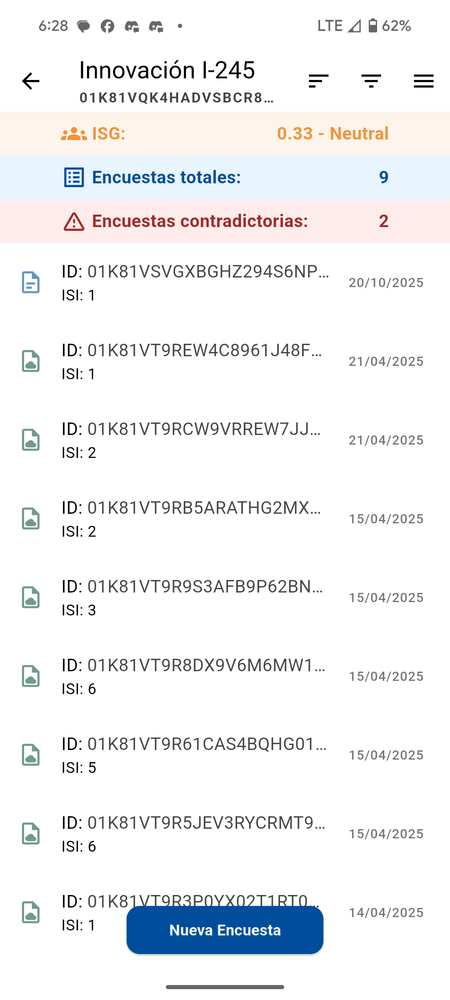
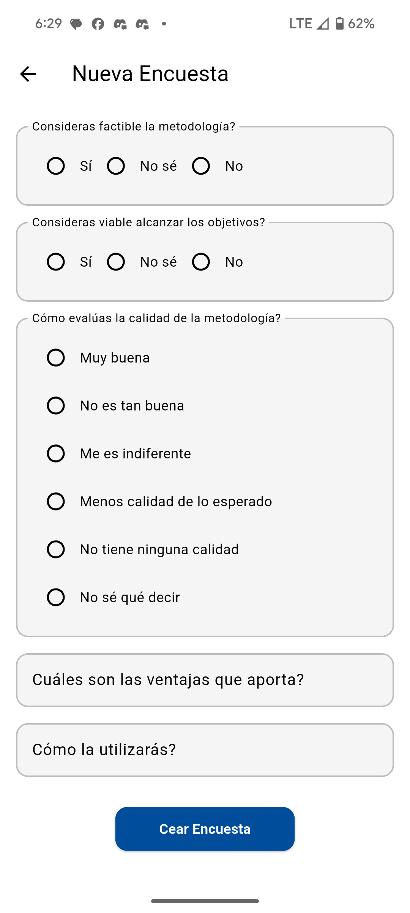
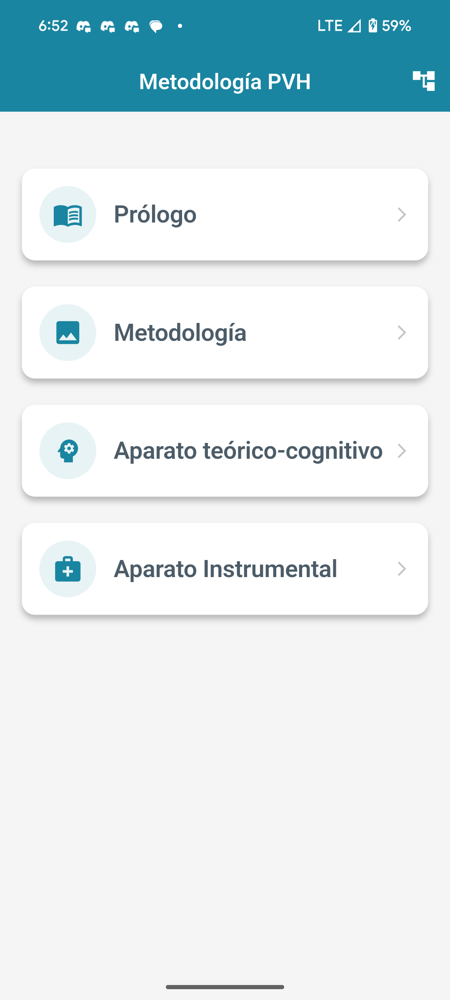
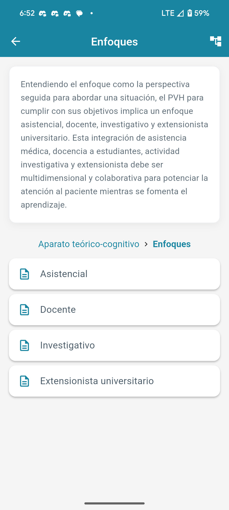

## Información de Contacto

- **Nombre:** Oscar Alejandro Rojas Rodríguez
- **Email:** ozkr.rouj@gmail.com
- **Teléfono:** +5358335917
- **GitHub:** https://github.com/OzkrRouj

---

# Tabla de Contenidos

- [Información de Contacto](#información-de-contacto)
- [Imágenes de los Proyectos](#imágenes-de-los-proyectos)
- [Stack Tecnológico](#stack-tecnológico)
- [Proyectos Destacados](#proyectos-destacados)
  - [1. Gestor de Contraseñas (ARCIS)](#1-gestor-de-contraseñas-arcis)
  - [2. ISG Iadov](#2-isg-iadov)
  - [3. Your Tennis Academy - Sistema de Gestión de Reservas](#3-your-tennis-academy---sistema-de-gestión-de-reservas)
  - [4. Predicción de Ataques Cardíacos](#4-predicción-de-ataques-cardíacos)
  - [5. Metodología Pase de Visita Hospitalario (PVH)](#5-metodología-pase-de-visita-hospitalario-pvh)
  - [6. Luna de Plata Joyería](#6-luna-de-plata-joyería)
  - [7. PIB La Trinidad](#7-pib-la-trinidad)

---

## Imágenes de los Proyectos

> [!IMPORTANT]
> **Nota:** Puedes visitar la carpeta [Images](Images/) para ver más capturas de pantalla de cada proyecto.

---

## Stack Tecnológico

| Categoría                  | Subcategoría         | Items                                                               |
| -------------------------- | -------------------- | ------------------------------------------------------------------- |
| Backend                    | Lenguajes            | Python                                                              |
| Backend                    | Frameworks           | Fast API, Django                                                    |
| Backend                    | APIs                 | Resend, Clerk, Supabase                                             |
| Desarrollo Multiplataforma | Lenguaje             | Dart                                                                |
| Desarrollo Multiplataforma | Frameworks           | Flutter                                                             |
| Bases de Datos             | SQL                  | PostgreSQL, MySQL, SQLite                                           |
| Bases de Datos             | ORMs                 | SQL Model, SQL Alchemy, Tortoise ORM, Django ORM                    |
| Ciencia de Datos           | Lenguajes            | Python                                                              |
| Ciencia de Datos           | Librerías            | Pandas, Numpy, Matplotlib, Seaborn, Plotly, Streamlit, Scikit-learn |
| Ciencia de Datos           | Herramientas         | Jupiter Notebooks                                                   |
| Ciencia de Datos           | Especialidades       | Análisis de Data, Machine Learning, Visualización                   |
| Frontend                   | Lenguajes            | HTML, CSS, JavaScript, TypeScript                                   |
| Frontend                   | Frameworks/Librerías | React, NextJS, Astro, Tailwind CSS, DaisyUI                         |
| Frontend                   | Herramientas         | Vite, Webpack/Turbopack, npm/pnpm, ESLint                           |
| Herramientas y Otros       | Control de versiones | Git, GitHub                                                         |
| Herramientas y Otros       | Cloud/Hosting        | Linux, Docker, Configuración de VPS, Despliegue en VPS              |
| Herramientas y Otros       | Headless CMS         | Directus, Sanity, Payload                                           |

---

## Proyectos Destacados

### 1. Gestor de Contraseñas (ARCIS)

#### Detalles

- **Estado:** 90%
- **Tipo de Proyecto:** Aplicación
- **Plataforma:** Móvil y Escritorio

 

- **Nota:** Este es un proyecto personal al cual le he dedicado mucho tiempo. Actualmente lo tengo para uso propio. Próximamente pienso subirlo y compartirlo gratis, posiblemente lo haga de código abierto. Todo lo que está escrito en las siguientes secciones está implementado en este momento.

#### Descripción

ARCIS es una aplicación Flutter avanzada para gestionar de forma segura credenciales, notas, tokens y accesos a servidores/bases de datos/repositorios. Enfatiza la seguridad con encriptación AES-256, derivación PBKDF2 y almacenamiento seguro, ofreciendo sincronización vía QR y archivos cifrados. Incluye resolución de conflictos visual, etiquetas relacionales y soporte multiplataforma (Windows, Linux, macOS, Android, iOS, Web). Sigue Material Design 3 con temas dinámicos y accesibilidad para una experiencia moderna.

#### Tecnologías

- **Lenguaje principal:** Dart
- **Framework principal**: Flutter 3.7+ con Dart SDK ^3.7.2.
- **Base de datos**: SQLite (sqflite para móviles, sqflite_common_ffi para escritorio) con migraciones automáticas y relaciones (tablas: credentials, notes, tokens, servers, databases, repos, tags, entity_tags).
- **Gestión de estado**: Provider para entidades como CredentialProvider, NoteProvider, TagProvider, etc.
- **Seguridad y encriptación**: `encrypt` (AES-256), `flutter_secure_storage`, `crypto` (PBKDF2 y HMAC para integridad).
- **UI/UX**: `flutter_screenutil` (responsive), `responsive_framework`, Material Design 3, `sticky_headers` para listas, `pretty_qr_code` para QRs modernos.
- **Internacionalización**: `intl`, `flutter_localizations` con soporte para español/inglés (main_locale: es).
- **Plataformas específicas**: `desktop_window`, `bitsdojo_window`, `window_manager` para ventanas en escritorio; `local_auth`, `permission_handler` para autenticación biométrica y permisos.
- **Otras utilidades**: `file_picker` para importación/exportación, `shared_preferences` para configuración, `archive` para compresión, `qr_flutter` y `mobile_scanner` para manejo de códigos QR, `ulid` para IDs únicos.
- **Desarrollo**: `intl_utils` para generación de locales.

#### Características Principales

- **Almacenamiento:** Solo en local con sincronización.
- **Sincronización segura**: Flujos "Enviar" y "Recibir" con autenticación biométrica/contraseña, generación de QRs modernos (dots/redondeados), escaneo integrado y subida automática a DataDeadDrop. Incluye resolución de conflictos campo a campo.
- **Gestión de entidades**: CRUD completo para credenciales (servicios, usuarios, contraseñas), notas privadas, tokens/API keys (con expiración), accesos a servidores (hosts, puertos), bases de datos y repositorios (URLs, autenticación SSH).
- **Sistema de etiquetas**: Relacional con agrupación visual, autocompletado dinámico y filtrado inteligente.
- **Funcionalidades avanzadas**: Favoritos, generador de contraseñas/tokens con efectos visuales, copia al portapapeles con feedback, historial de modificaciones, importación/exportación cifrada de base de datos portable.
- **Interfaz modular**: Navegación por pestañas y Drawer, búsqueda/filtrado en tiempo real, modo oscuro/claro automático, animaciones y componentes reutilizables (CustomAppBar, CustomCard, TagGroupGrid, etc.).
- **Arquitectura estructurada**: Separación en `[components/], [database/], [providers/], [pages/], [utils/]`, con soporte para temas personalizables y accesibilidad (semantics, navegación por teclado).

#### Habilidades Requeridas

- **Lenguajes y frameworks**: Dominio avanzado de Dart y Flutter, incluyendo Provider para gestión de estado reactiva y manejo de plataformas múltiples (móvil, escritorio, web).
- **Bases de datos y seguridad**: Experiencia con SQLite, diseño de esquemas relacionales, encriptación AES-256, derivación de claves (PBKDF2), HMAC y almacenamiento seguro (Flutter Secure Storage). Conocimientos en manejo de conflictos de datos y transacciones atómicas.
- **UI/UX y diseño**: Habilidades en Material Design 3, diseño responsivo, animaciones, accesibilidad (WCAG) y herramientas como Figma o similares para prototipado. Familiaridad con componentes personalizados y temas dinámicos.
- **Integraciones externas**: Manejo de APIs para sincronización (e.g., DataDeadDrop), bibliotecas de QR (pretty_qr_code, mobile_scanner), autenticación biométrica (local_auth) y permisos (permission_handler).
- **Desarrollo multiplataforma**: Configuración de ventanas en escritorio (window_manager), builds para Android/iOS/Web, y resolución de diferencias entre plataformas (e.g., inicialización condicional en main.dart).
- **Internacionalización**: Uso de intl para locales.
- **Otras competencias**: Manejo de archivos (file_picker, archive), preferencias compartidas, y prácticas de desarrollo como separación de responsabilidades, componentes reutilizables y flujo de Git para contribución.
- **Herramientas de desarrollo:** IDEs (VS Code, Android Studio), Git, Flutter CLI y empaquetado (ISS).

---

### 2. ISG Iadov

#### Detalles

- **Estado:** Terminado
- **Tipo de Proyecto:** Aplicación
- **Plataforma:** Móvil y Escritorio
- **Link:** [Link al artículo científico](https://www.scienceopen.com/document?vid=19d805d5-10b1-44b6-a499-21493b85eeab)

 

- **Nota:** Esta app fue como resultado de la publicación un artículo científico donde puede colaborar también como investigador.

#### Descripción

ISG Iadov es una aplicación móvil y de escritorio en Flutter para gestionar y analizar encuestas de satisfacción grupal mediante el modelo IADOV. Permite crear proyectos con preguntas personalizadas, recopilar respuestas, calcular métricas como el ISI e ISG, y exportar a PDF/CSV. Incluye integración con SQLite, soporte para CSV y Google Sheets, enfocada en evaluar factibilidad, viabilidad y calidad de proyectos.

#### Tecnologías

- **Lenguaje principal:** Dart
- **Framework:** Flutter (para desarrollo multiplataforma: Android, iOS, Windows, Linux, macOS, Web)
- **Base de datos:** SQLite con `sqflite` y `sqflite_common_ffi` para soporte en escritorio
- **Gestión de estado:** Provider para manejo de estado reactivo
- **Gráficos y visualización:** Syncfusion Flutter Charts para representación de datos
- **Exportación de datos:**
  - PDF con `pdf` y `printing` para generación e impresión de informes
  - CSV con `csv` para exportación de datos tabulares
- **Formularios y validación:** Flutter Form Builder con `form_builder_validators`
- **Manejo de archivos:** `file_picker`, `file_saver`, `share_plus` para selección, guardado y compartición
- **Permisos y utilidades:** `permission_handler`, `shared_preferences`, `intl` para internacionalización y almacenamiento local
- **Autenticación y servicios externos:** Integración opcional con Google Sheets vía `url_launcher`
- **Dependencias de desarrollo:** Flutter Launcher Icons para optimización y configuración

#### Características Principales

- **Gestión de proyectos:** Creación, edición y eliminación de proyectos con preguntas personalizables (factibilidad, viabilidad, calidad, respuestas abiertas).
- **Recolección de encuestas:** Formularios para capturar respuestas con escalas IADOV (1-6) y campos abiertos, asociadas a proyectos específicos.
- **Cálculo de métricas:** Implementación del Índice de Satisfacción Grupal (ISG) basado en fórmulas específicas del modelo IADOV, con categorización automática de respuestas.
- **Exportación de datos:** Generación de informes PDF con resúmenes, gráficos y tablas; exportación a CSV para análisis externos.
- **Sincronización y backup:** Soporte para importar/exportar datos desde archivos CSV, integración con Google Sheets y manejo de bases de datos locales con nombres dinámicos.
- **Interfaz de usuario:** Tema personalizado con colores corporativos, navegación por rutas, búsqueda de proyectos y widgets reutilizables.
- **Persistencia de datos:** Uso de SQLite para almacenamiento offline, con manejo de versiones y respaldo automático.
- **Funcionalidades adicionales:** Pantallas para detalles de proyectos/encuestas, ayuda integrada, y soporte para múltiples plataformas con inicialización específica (e.g., FFI para escritorio).

#### Habilidades Requeridas

- **Conocimientos avanzados en Flutter/Dart:** Dominio de widgets, estado con Provider, navegación y manejo de plataformas múltiples.
- **Bases de datos:** Experiencia con SQLite, consultas SQL y manejo de datos asíncronos.
- **Desarrollo móvil:** Conocimientos en permisos de archivos, integración con sistemas operativos y despliegue en Android/iOS.
- **Manipulación de datos:** Procesamiento de CSV, generación de PDF y manejo de archivos externos.
- **Arquitectura de software:** Patrón Provider para gestión de estado, separación de responsabilidades (models, providers, services).
- **Herramientas de desarrollo:** IDEs (VS Code, Android Studio), Git, Flutter CLI y empaquetado (ISS).
- **Análisis y métricas:** Comprensión del modelo IADOV para cálculo de índices de satisfacción y visualización de datos.

---

### 3. Your Tennis Academy - Sistema de Gestión de Reservas

#### Detalles

- **Estado:** Terminado
- **Tipo de Proyecto:** Backend + Frontend + DevOps
- **Plataforma:** Web
  

#### Descripción

Sistema completo para la gestión de reservas de una academia de tenis, compuesto por un panel administrativo moderno desarrollado con Next.js (frontend) y una API robusta construida con FastAPI (backend). Permite la administración de turnos, citas, canchas y usuarios con funcionalidades avanzadas como auditoría de cambios, notificaciones automáticas y soporte para clases individuales y grupales. Incluye integración con Supabase para autenticación segura y despliegue con Docker para entornos de desarrollo y producción.

#### Tecnologías

##### Frontend

- **Framework**: Next.js 14 con App Router
- **Lenguaje**: TypeScript 5+
- **Estilos**: Tailwind CSS y CSS Modules
- **Componentes UI**: shadcn/ui basado en Radix UI
- **Validación de Formularios**: Zod y React Hook Form
- **Manejo de Estado**: React Query para consultas asincrónicas
- **Manejo de Fechas**: date-fns y date-fns-tz
- **Autenticación**: Supabase Auth (JWT con OAuth2)
- **Iconografía**: Lucide React
- **Calendario**: FullCalendar para interfaz interactiva
- **Notificaciones**: Sonner para toast notifications

##### Backend

- **Framework**: FastAPI (Python 3.12+) con estándar ASGI
- **ORM**: SQLModel (combinación de SQLAlchemy y Pydantic v2)
- **Base de Datos**: PostgreSQL 13+ (recomendada) o SQLite para desarrollo
- **Autenticación**: JWT con python-jose y Supabase
- **Validación**: Pydantic v2 para esquemas de datos
- **Rate Limiting**: FastAPI-Limiter y SlowAPI
- **Paginación**: FastAPI-Pagination
- **Documentación**: OpenAPI/Swagger integrado
- **Migraciones**: Alembic
- **Configuración**: pydantic-settings y python-dotenv
- **Identificadores**: ULID para IDs únicos y ordenables
- **Notificaciones por Email**: Resend para envío de correos
- **Logs**: Estructurados en JSON con rotación automática

##### DevOps e Infraestructura

- **Contenedorización**: Docker y Docker Compose
- **Base de Datos en Contenedor**: PostgreSQL con pgAdmin para gestión visual
- **CI/CD**: GitHub Actions y despliegue
- **Gestión de Dependencias**: uv para Python (backend) y pnpm para Node.js (frontend)

#### Características Principales

##### Funcionalidades Core

- **Gestión de Turnos**:

  - Generación automática de turnos por rangos de fechas (mes actual + siguiente)
  - Estados personalizables: Disponible, Reservado, Pendiente, Bloqueado, Deshabilitado
  - Sistema de influencia para priorización y bloqueo de horarios cercanos
  - Creación manual de turnos para meses futuros

- **Gestión de Citas**:

  - Reserva de turnos con validación en tiempo real
  - Soporte para clases individuales y grupales (Grupo_Cantidad)
  - Gestión de cancha propia o del cliente (Cancha_Cliente y Cancha_Direccion)
  - Estados de cita: Pendiente, Confirmada, Cancelada, Completada
  - Reprogramación y reactivación de citas canceladas
  - Aceptación/cancelación con actualización automática de estados

- **Auditoría y Seguimiento**:

  - Registro automático de usuario que crea/modifica registros (user_created, user_updated)
  - Timestamps precisos (date_created, date_updated)
  - Trazabilidad completa de operaciones

- **Autenticación y Seguridad**:

  - Integración con Supabase Auth para login seguro
  - Protección de rutas y API con JWT
  - Rate limiting avanzado (7 peticiones/minuto por endpoint crítico)
  - Middleware de verificación de tokens

- **Notificaciones**:

  - Envío automático de confirmaciones de reserva
  - Notificaciones de cancelación
  - Plantillas HTML responsivas con Resend

- **Interfaz de Usuario**:

  - Panel administrativo responsivo con diseño moderno
  - Calendario interactivo con arrastrar y soltar
  - Filtros avanzados por fechas, estados y clientes
  - Paginación en listados para mejor rendimiento
  - Soporte móvil optimizado

- **API RESTful**:
  - Endpoints completos para turnos y citas (CRUD)
  - Búsqueda y filtrado avanzado
  - Documentación automática con Swagger/ReDoc
  - Manejo de errores global estandarizado

##### Arquitectura y Estructura de Código

- **Modularidad**: Código organizado en módulos especializados (frontend/src/app, backend/app)
- **Tipado Estricto**: Uso extensivo de TypeScript en frontend y Pydantic en backend
- **Validación Robusta**: Esquemas de datos con Zod y Pydantic
- **Logs Estructurados**: Formato JSON para análisis y monitoreo
- **Configuración por Entorno**: Variables de entorno unificadas para desarrollo/producción

#### Habilidades Requeridas

##### Frontend

- **Conocimientos Avanzados**: React 19, Next.js 14 (App Router), TypeScript 5+
- **Estilos y UI**: Tailwind CSS, shadcn/ui, diseño responsivo
- **Estado y Datos**: React Query, manejo de formularios con React Hook Form
- **Autenticación**: Integración con Supabase Auth
- **Herramientas**: Git, Node.js 18+, pnpm

##### Backend

- **Conocimientos Avanzados**: Python 3.12+, FastAPI, SQLModel/SQLAlchemy
- **Bases de Datos**: PostgreSQL, diseño de esquemas relacionales
- **Autenticación**: JWT, OAuth2, manejo de sesiones
- **Desarrollo API**: RESTful, OpenAPI, manejo de errores
- **Herramientas**: uv, Alembic, Docker

##### Generales

- **DevOps**: Docker, Docker Compose, CI/CD con GitHub Actions
- **Bases de Datos**: Modelado relacional, migraciones, optimización de consultas
- **Seguridad**: Rate limiting, autenticación segura, protección contra abuso
- **Colaboración**: Git, documentación técnica
- **Despliegue**: Configuración de entornos, monitoreo de logs

---

### 4. Predicción de Ataques Cardíacos

#### Detalles

- **Estado:** Terminado
- **Tipo de Proyecto:** Ciencia de Datos
- **Plataforma:** Procesamiento de datos + Entrenamiento de modelos de Machine Learning + Visualización Web
- **Links:** [Modelo Predictor Web](https://heart-attack-ds-rforest.streamlit.app/)

  

- **Notas:** Esto fue el trabajo final de un postgrado en la Universidad de Barcelona en Ciencia de Datos aplicado a Medicina y Biología. Me encargué de toda la preparación de los datos, entrenamiento del modelo predictor (Random Forest), creación de la web para visualizarlo y despliegue en streamlit.

#### Descripción

Proyecto de ciencia de datos para predecir ataques cardíacos mediante análisis exploratorio y multivariante de datos clínicos. Emplea un modelo de Random Forest entrenado con variables como edad, presión arterial y biomarcadores. Incluye una aplicación web en Streamlit para predicciones interactivas y visualización de resultados. Genera reportes automáticos con métricas de evaluación y gráficos de árboles de decisión. Flujo de trabajo automatizado vía Makefile para preprocesamiento, entrenamiento y evaluación.

#### Tecnologías

- **Lenguaje**: Python 3.13.
- **Análisis y ML**: Pandas, NumPy, SciPy, Scikit-learn (Random Forest, métricas).
- **Visualización**: Matplotlib, Seaborn, Plotly, Graphviz.
- **Web y entornos**: Streamlit (interfaz), Conda (entornos), Jupyter (notebooks), Joblib (modelos), Make (automatización).

#### Características Principales

- **Estructura modular**: Notebooks para análisis exploratorio (e.g., normalidad, variables bioquímicas); scripts en [src/] para preprocesamiento, entrenamiento y evaluación.
- **Modelo**: Random Forest con hiperparámetros optimizados (150 árboles, profundidad 10, balanceo de clases).
- **Funcionalidades**: División de datos (train/test), métricas (precisión, AUC, Kappa), reportes (texto, imágenes PNG, CSV).
- **App web**: Navegación interactiva para predicciones, reportes y visualización de árboles.
- **Automatización**: Comandos `make` para ejecutar pipeline completo en entornos Windows/Conda.

#### Habilidades requeridas

- Programación en Python (manejo de datos, ML básico).
- Machine Learning (Random Forest, evaluación de modelos).
- Análisis de datos (Pandas, visualización con Matplotlib).
- Desarrollo web básico (Streamlit para interfaces).
- Herramientas de entorno (Conda, Make, terminal en Windows).

---

### 5. Metodología Pase de Visita Hospitalario (PVH)

#### Detalles

- **Estado:** Terminado
- **Tipo de Proyecto:** Aplicación
- **Plataforma:** Móvil y Escritorio

 

- **Notas:** Esta app está relacionada con el proyecto ISG Iadov, ya que fue utilizado para validar la aplicación de esta metodología.

#### Descripción

Aplicación Flutter para la metodología del Pase de Visita Hospitalario (PVH), basada en investigación académica de la Universidad Central "Marta Abreu" de Las Villas (2025). Dirigida a docentes y estudiantes en educación médica superior, integra asistencia, docencia, investigación y extensión universitaria mediante contenido jerárquico en Markdown, navegación intuitiva, soporte para imágenes y PDFs.

#### Tecnologías

- **Lenguaje principal:** Dart
- **Framework principal:** Flutter (SDK ^3.7.2) con Dart para desarrollo multiplataforma (Android, iOS, Windows, Linux, macOS, Web).
- **Gestión de estado:** Provider (^6.1.1) para estado reactivo; Shared Preferences (^2.2.2) para persistencia de navegación.
- **UI y temas:** Google Fonts (^6.1.0) para tipografía; Material Design 3 con tema personalizado (colores: primario #1985A1, secundario #4C5C68).
- **Visualización de contenido:** Flutter Markdown Plus (^1.0.5) para Markdown avanzado; Flutter SVG (^2.0.9) para gráficos vectoriales.
- **Funcionalidades adicionales:** Path Provider (^2.1.4) y Open FileX (^4.5.0) para manejo de archivos y PDFs; URL Launcher (^6.2.2) para enlaces externos.
- **Desarrollo y despliegue:** herramientas como Launcher Icons.
- **Assets:** Organización jerárquica en `assets/markdown/`, `assets/images/`, `assets/pdf/` (ej. `prologo.md`, `metodologia.png`, `tdi.pdf`).

#### Características Principales

- **Navegación jerárquica:** Estructura en árbol ilimitada con breadcrumbs y rutas dinámicas vía NavigationService y NavigationController.
- **Mapa de navegación:** Diálogo fullscreen que muestra el árbol completo, resalta nodo actual y recuerda estado entre sesiones.
- **Visualización de contenido:** Renderizado Markdown optimizado con estilos personalizados, soporte para imágenes y descarga de PDFs.
- **Interfaz responsiva:** Diseño adaptable con tarjetas en HomeScreen, tema consistente y optimizaciones para Windows.
- **Persistencia de estado:** NavigationController recuerda posición y expansiones usando SharedPreferences.
- **Soporte multimedia:** Ítems navegables con imágenes y PDFs integrados.
- **Arquitectura modular:** Capas separadas (models, screens, services, theme, widgets) para mantenibilidad.

#### Habilidades Requeridas

- **Desarrollo con Flutter/Dart:** Conocimientos en widgets, rutas, manejo de estado (Provider), asincronía, persistencia.
- **Diseño de UI/UX:** Interfaces responsivas, temas personalizados y optimización multiplataforma con Material Design.
- **Gestión de contenido:** Organización de archivos Markdown, imágenes y PDFs; conocimiento básico de Markdown.
- **Arquitectura de software:** Patrones como MVC, manejo de servicios y controladores para navegación compleja.
- **Conocimientos del dominio:** Familiaridad con metodología educativa en medicina y conceptos pedagógicos.
- **Herramientas de desarrollo:** IDEs (VS Code, Android Studio), Git, Flutter CLI y empaquetado (ISS).

---

### 6. Luna de Plata Joyería

#### Detalles

- **Estado:** En construcción (70%)
- **Tipo de Proyecto:** Frontend
- **Plataforma:** Web

  

- **Notas:** Al encontrarse el sitio en construcción, los productos y los textos de las diferentes secciones de la web son solo para mostrar cómo se vería el contenido. Serán sustituidos por los reales para el momento del lanzamiento.

#### Descripción

Este es un catálogo web para la tienda de joyas "Luna de Plata" (nombre original: Guillermo Store). Se trata de una aplicación moderna construida como catálogo en línea que presenta productos artesanales como anillos, collares, pendientes, pulseras, relojes, tobilleras, conjuntos y otros artículos. Utiliza generación estática con contenido dinámico gestionado vía CMS headless (Sanity), incluyendo búsqueda en tiempo real, filtros y cálculo de precios en CUP. La estructura incluye componentes reutilizables en Astro/React, páginas dinámicas y despliegue en Netlify.

#### Tecnologías

- **Framework**: Astro 5.14.3 (generación estática e híbrida).
- **CMS**: Sanity 4.10.2 (gestión de contenido, consultas GROQ).
- **Lenguaje**: TypeScript (tipos para productos, categorías).
- **UI/Estilos**: TailwindCSS 4.1.14 y DaisyUI 5.1.29 (estilos responsivos y componentes).
- **Integraciones**: React 19.2.0 (@astrojs/react), Sanity Client, Image URL Builder.
- **Despliegue**: @astrojs/netlify (preparado para Netlify).

#### Características Principales

- **Navegación**: Navbar dinámico con categorías ordenadas desde Sanity; filtros por subcategorías/materiales vía FilterSidebar.
- **Catálogo**: Páginas por categoría (e.g., anillos.astro), productos individuales y búsqueda dinámica (busqueda/[...query].astro).
- **Funcionalidades**: Búsqueda en tiempo real (máx. 4 resultados), cálculo de precios CUP con tasas de cambio, shuffle de productos.
- **UI/UX**: Diseño responsivo con animaciones, componentes reutilizables (ProductCard, SearchResult), estilos globales.

#### Habilidades Requeridas

- **Básicas**: HTML, CSS, JavaScript, TypeScript.
- **Frameworks**: Astro (rutas basadas en archivos, islas de hidratación); Sanity (consultas GROQ, esquemas).
- **UI/Estilos**: TailwindCSS (utilitarios responsivos); DaisyUI (componentes predefinidos).
- **Otras**: React para componentes interactivos; manejo de APIs asíncronas; diseño responsivo y accesibilidad.

---

### 7. PIB La Trinidad

#### Detalles

- **Estado:** Terminado y en Actualización
- **Tipo de Proyecto:** Frontend + Backend + DevOps
- **Plataforma:** Web
- **Links:** [Sitio Web](https://piblatrinidadsc.org/)

  

#### Descripción

Sitio web oficial de la Primera Iglesia Bautista "La Trinidad" en Cuba, enlace para inscribirse a la Semana de la Juventud 2025 (12-15 agosto). Plataforma completa para eventos eclesiásticos con sistema de inscripciones gestionado vía Directus CMS, desplegado en VPS con automatización GitHub Actions y respaldado por PostgreSQL.

#### Tecnologías

- Astro 5.8.0 con SSR (Node adapter) para el framework principal.
- TailwindCSS 4.1.7 + DaisyUI para UI responsiva.
- Directus SDK para CMS headless con PostgreSQL como base de datos.
- Zod para validación, Axios para HTTP.
- TypeScript, pnpm, Docker para desarrollo y contenedorización.
- GitHub Actions para automatización de despliegue en VPS.

#### Características Principales

- Estructura modular con componentes Astro reutilizables y layouts base.
- Página principal con hero, eventos y redes sociales.
- Formulario de inscripción multi-paso con validación en tiempo real, cuenta regresiva y programa.
- Integración Directus con PostgreSQL para almacenamiento seguro de datos (e.g., registros de usuarios).
- Despliegue automatizado en VPS vía GitHub Actions, construyendo imágenes Docker con variables de entorno y ejecutando en puerto 4321 con soporte local y producción.

#### Habilidades requeridas

- Astro, TailwindCSS/DaisyUI para desarrollo web front-end.
- Directus y PostgreSQL para gestión de CMS y bases de datos.
- Zod, TypeScript para validación y tipado.
- Docker, GitHub Actions para contenedorización y CI/CD en VPS.
- JavaScript/TypeScript intermedio, diseño responsivo, accesibilidad y configuración de servidores.
